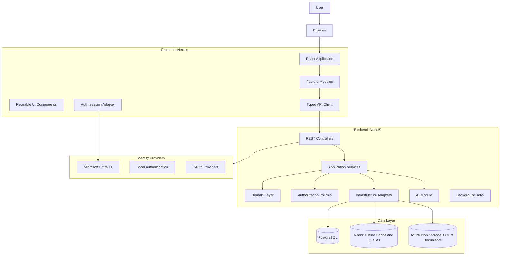
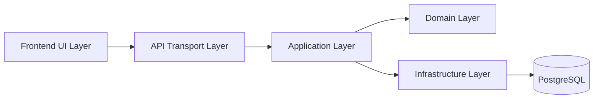
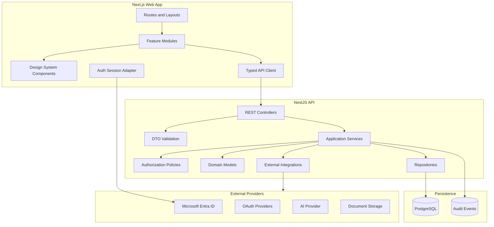
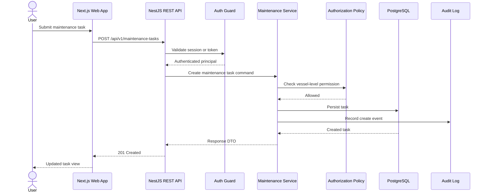
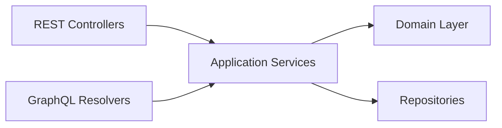
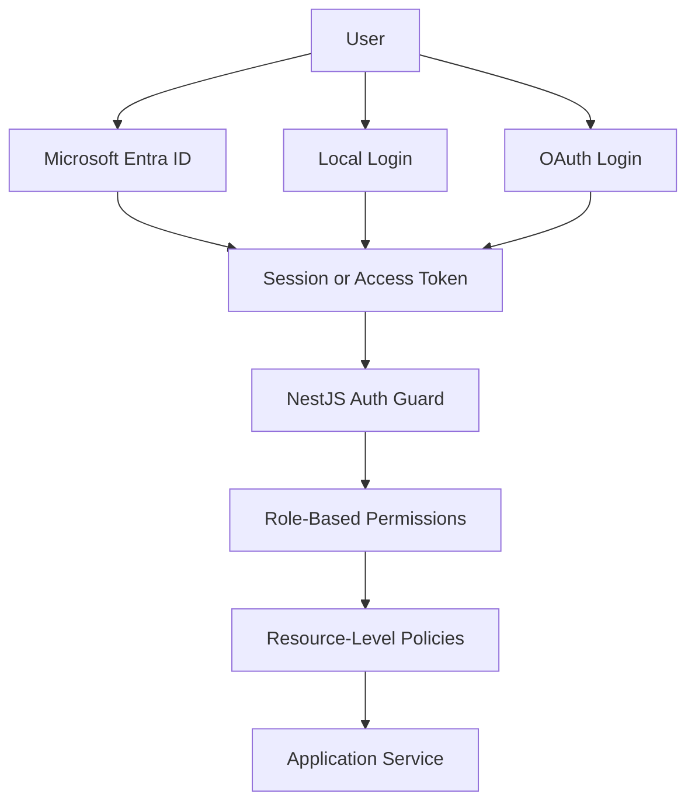
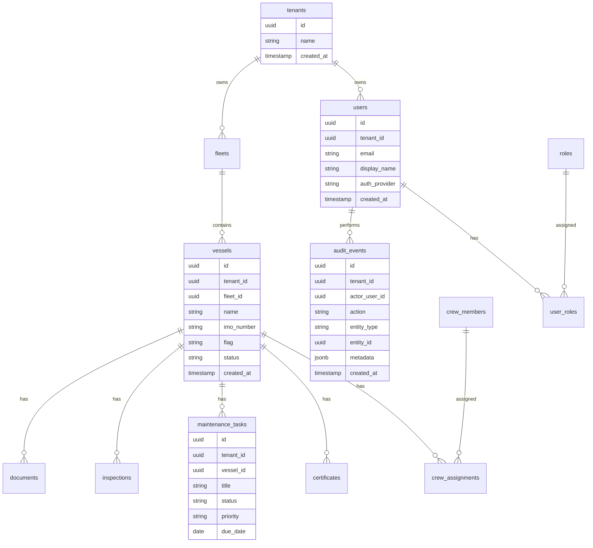
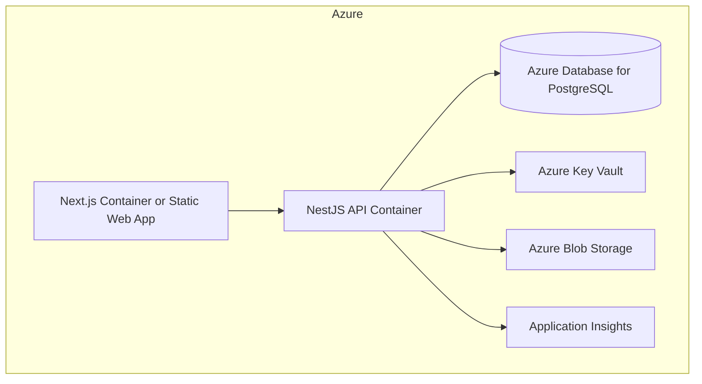
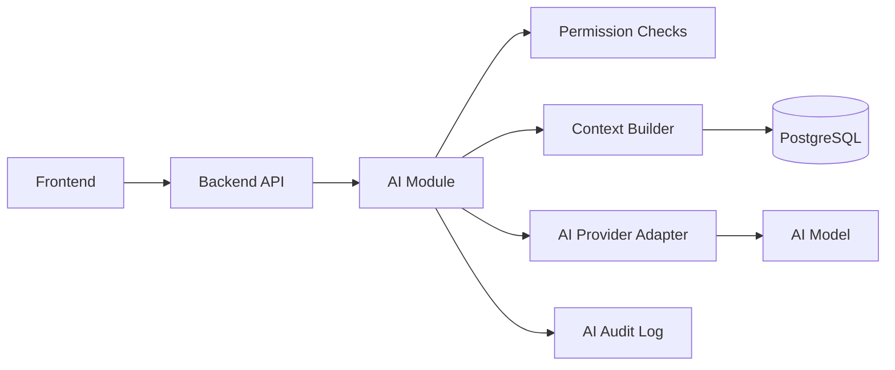

# Vessel Management System Enterprise Architecture

## Architecture Overview



## Layering



The frontend owns presentation, routing, forms, and client-side interaction. The backend owns business workflows, authorization, validation, persistence orchestration, integrations, audit logging, and AI coordination. The domain layer owns business concepts and rules. Infrastructure owns external systems such as PostgreSQL, storage, identity providers, email, logging, and AI providers.

Business logic must not live in React components, REST controllers, GraphQL resolvers, or database access classes.

## Recommended Repository Structure

```txt
vessel-management-system/
  apps/
    web/
      src/
        app/
        components/
        features/
          auth/
          vessels/
          crew/
          maintenance/
          certificates/
          inspections/
        lib/
          api/
          auth/
          validation/
        styles/
        tests/
      next.config.ts
      tailwind.config.ts
      package.json

    api/
      src/
        main.ts
        app.module.ts
        modules/
          auth/
          users/
          vessels/
          crew/
          maintenance/
          certificates/
          inspections/
          documents/
          audit/
          ai/
          notifications/
        common/
          decorators/
          filters/
          guards/
          interceptors/
          logging/
          validation/
        config/
        database/
          prisma/
            schema.prisma
            migrations/
        tests/
      package.json

  packages/
    shared/
      src/
        constants/
        types/
        validation/
      package.json

  docker/
    api.Dockerfile
    web.Dockerfile
    postgres/

  docs/
    architecture/
    api/
    security/

  docker-compose.yml
  package.json
  tsconfig.base.json
  .env.example
```

The `packages/shared` workspace must stay narrow. It is for stable contracts, shared types, constants, and validation schemas only. It must not become a place for backend business logic or frontend implementation details.

## Component Diagram



## Data Flow

Example: creating a vessel maintenance task.



The frontend may hide unavailable actions, but the backend must always enforce authorization.

## API Strategy

Use versioned REST APIs for the first production foundation:

```txt
/api/v1/auth
/api/v1/users
/api/v1/fleets
/api/v1/vessels
/api/v1/crew
/api/v1/certificates
/api/v1/maintenance-tasks
/api/v1/inspections
/api/v1/documents
/api/v1/audit-events
/api/v1/ai
```

API standards:

- Use OpenAPI documentation generated from the backend.
- Use DTO validation at API boundaries.
- Use pagination, filtering, and sorting for list endpoints.
- Use idempotency keys for critical create/update operations where duplicate submission would be harmful.
- Use correlation IDs for tracing requests.
- Use structured error responses with stable error codes.
- Keep controllers thin and delegate business logic to application services.

Recommended response envelope:

```json
{
  "data": {},
  "meta": {},
  "errors": []
}
```

Recommended error shape:

```json
{
  "error": {
    "code": "VESSEL_NOT_FOUND",
    "message": "Vessel was not found.",
    "details": {}
  }
}
```

### Future GraphQL

GraphQL should be added as a second transport layer only when the product has dashboards or complex client query needs that REST cannot serve cleanly.



GraphQL resolvers must reuse the same application services as REST controllers.

## Security Model



Authentication paths:

- Microsoft Entra ID for enterprise customers.
- Local authentication for development, demos, smaller deployments, and controlled fallback.
- OAuth provider support for future customer identity requirements.

Authorization model:

- Use RBAC for broad capability assignment.
- Use resource-level policies for fleet and vessel access.
- Keep authorization checks on the backend.

Initial roles:

- `SystemAdmin`
- `FleetManager`
- `VesselManager`
- `CrewManager`
- `Inspector`
- `MaintenanceUser`
- `ReadOnlyAuditor`

Initial permission groups:

- `vessel.read`
- `vessel.create`
- `vessel.update`
- `vessel.delete`
- `crew.read`
- `crew.assign`
- `crew.remove`
- `maintenance.read`
- `maintenance.create`
- `maintenance.close`
- `certificate.read`
- `certificate.upload`
- `certificate.approve`
- `audit.read`

Required controls:

- Strong password hashing with Argon2 or bcrypt for local accounts.
- MFA delegated to Microsoft Entra ID where available.
- HTTPS in deployed environments.
- Secure cookies if cookie-backed sessions are used.
- CSRF protection when cookies are used for authentication.
- CORS allowlist.
- Rate limiting.
- Request validation.
- ORM or parameterized SQL access.
- Immutable audit logs for sensitive operations.
- Secrets outside source control.
- Least-privilege database accounts.
- Soft delete for critical business records.
- Application-level resource ownership checks.
- Future PostgreSQL Row Level Security if compliance or tenant isolation requires it.

## Data Architecture



Use UUID primary keys from the beginning. Include `tenant_id` early if commercial multi-customer deployment is likely. Retrofitting tenancy after data and authorization logic exist is a major risk.

## Docker And Hosting

Local development should use Docker Compose:

```txt
web       Next.js application
api       NestJS API
postgres  PostgreSQL database
redis     Future cache and queue service
```

Recommended local URLs:

```txt
web:      http://localhost:3000
api:      http://localhost:4000
postgres: localhost:5432
redis:    localhost:6379
```

Future Azure deployment:



Use Azure Container Apps or Azure App Service for the API. Choose Azure Static Web Apps only if the frontend deployment model fits the authentication and runtime requirements.

## AI Architecture



AI integration rules:

- The frontend must not call AI providers directly.
- Prompts and AI orchestration must live on the backend.
- Permission checks must run before retrieving vessel, crew, document, or compliance context.
- AI usage must be auditable.
- Sensitive data must not be sent to external AI providers unless explicitly allowed by configuration and policy.
- AI output used in operational decisions must be stored with provenance.
- AI suggestions are advisory unless a human explicitly confirms the action.

## Scalability Concerns

Design for these from the start:

- Multi-tenancy.
- Fleet and vessel-level authorization.
- Immutable audit history.
- Large document storage.
- Background jobs.
- AI usage tracking and cost controls.
- Reporting and analytics.
- Data retention policies.
- Customer-specific identity providers.
- Offline or low-connectivity workflows.
- External maritime system integrations.
- PostgreSQL performance under high operational record volume.

## Locked Baseline

This architecture is the accepted baseline for implementation. Changes to these major decisions should be recorded as additional Architecture Decision Records.
