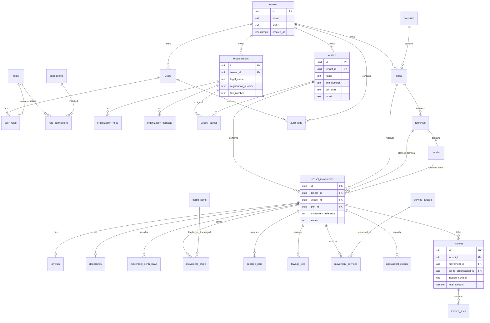

# PostgreSQL Database Design

## Design Goals

This database design is for an enterprise Vessel Management System with commercial SaaS potential. It is intentionally normalized to reduce duplication, preserve data integrity, and support future reporting, audit, tenant isolation, and integration requirements.

Primary goals:

- Normalize core business entities to at least third normal form.
- Keep tenant isolation explicit through `tenant_id`.
- Model organizations once, then assign business roles such as owner, operator, agent, service provider, and invoice counterparty.
- Keep vessel movements as the operational center of arrivals, departures, berth visits, cargo, pilotage, towage, services, invoices, and events.
- Support immutable audit history.
- Support RBAC permissions and future resource-level authorization.
- Use PostgreSQL-native strengths such as UUIDs, constraints, partial indexes, range-friendly timestamps, and JSONB only for metadata or integration payloads.

## Design Trade-Offs

### Normalized Core vs Reporting Convenience

The transactional schema is normalized. This reduces anomalies and keeps commercial data trustworthy. The trade-off is that operational dashboards will need joins. For analytics, use materialized views, read models, or a future reporting warehouse rather than denormalizing the source of truth too early.

### Party Model vs Separate Owner, Operator, Agent Tables

Owners, operators, agents, service providers, and invoice parties are all organizations with different roles. A single `organizations` table plus role/link tables avoids duplicated addresses, tax IDs, contacts, and external references.

Separate tables for each role would be easier to understand at first, but it would create repeated columns and painful integration mapping later.

### Movement-Centric Operations

Arrivals and departures are modeled as one-to-one extensions of `vessel_movements`, rather than standalone unrelated records. This keeps all operational activity connected to a single port call lifecycle.

### JSONB Usage

JSONB is allowed for metadata, external provider payloads, and audit snapshots. It should not replace relational columns for searchable, validated, or permission-sensitive business data.

## ER Diagram



## Naming And Data Standards

- Primary keys: `uuid`.
- Tenant key: `tenant_id uuid not null` on tenant-owned business tables.
- Timestamps: `created_at timestamptz not null`, `updated_at timestamptz not null`.
- Soft delete: `deleted_at timestamptz null` on operational master data.
- Money: `numeric(14,2)` plus `currency_code char(3)`.
- Dates and times: use `timestamptz` for operational event times.
- Status fields: use constrained text or PostgreSQL enums once lifecycle states are stable.
- External references: store in dedicated columns where important; use JSONB only for raw integration metadata.

Recommended PostgreSQL extensions:

- `pgcrypto` for UUID generation if UUIDs are generated in PostgreSQL.
- `citext` for case-insensitive email fields.
- `btree_gist` later if exclusion constraints are needed for berth scheduling windows.
- `pg_trgm` later if fuzzy search is needed for vessels, organizations, ports, and movement references.

## Tables

### Tenancy

#### `tenants`

| Column       |        Type | Key | Notes                           |
| ------------ | ----------: | --- | ------------------------------- |
| `id`         |        uuid | PK  | Tenant identifier               |
| `name`       |        text |     | Tenant display name             |
| `slug`       |        text | UQ  | Stable tenant slug              |
| `status`     |        text |     | `active`, `suspended`, `closed` |
| `created_at` | timestamptz |     | Creation timestamp              |
| `updated_at` | timestamptz |     | Update timestamp                |

Indexes:

- `uq_tenants_slug unique (slug)`
- `idx_tenants_status (status)`

### Identity And Access

#### `users`

| Column             |        Type | Key | Notes                           |
| ------------------ | ----------: | --- | ------------------------------- |
| `id`               |        uuid | PK  | User identifier                 |
| `tenant_id`        |        uuid | FK  | References `tenants.id`         |
| `email`            |      citext |     | Case-insensitive email          |
| `display_name`     |        text |     | User name                       |
| `auth_provider`    |        text |     | `entra`, `local`, `oauth`       |
| `external_subject` |        text |     | Entra/OAuth subject identifier  |
| `password_hash`    |        text |     | Nullable; local auth only       |
| `status`           |        text |     | `active`, `invited`, `disabled` |
| `last_login_at`    | timestamptz |     | Last successful login           |
| `created_at`       | timestamptz |     | Creation timestamp              |
| `updated_at`       | timestamptz |     | Update timestamp                |
| `deleted_at`       | timestamptz |     | Soft delete timestamp           |

Keys and indexes:

- `pk_users (id)`
- `fk_users_tenant_id -> tenants.id`
- `uq_users_tenant_email unique (tenant_id, email) where deleted_at is null`
- `idx_users_tenant_status (tenant_id, status)`
- `idx_users_external_subject (auth_provider, external_subject)`

#### `roles`

| Column           |        Type | Key | Notes                                         |
| ---------------- | ----------: | --- | --------------------------------------------- |
| `id`             |        uuid | PK  | Role identifier                               |
| `tenant_id`      |        uuid | FK  | Nullable for system-defined roles if required |
| `code`           |        text |     | Stable role code                              |
| `name`           |        text |     | Display name                                  |
| `description`    |        text |     | Role purpose                                  |
| `is_system_role` |     boolean |     | Protects built-in roles                       |
| `created_at`     | timestamptz |     | Creation timestamp                            |
| `updated_at`     | timestamptz |     | Update timestamp                              |

Indexes:

- `uq_roles_tenant_code unique (tenant_id, code)`
- `idx_roles_tenant_id (tenant_id)`

#### `permissions`

| Column        |        Type | Key | Notes                  |
| ------------- | ----------: | --- | ---------------------- |
| `id`          |        uuid | PK  | Permission identifier  |
| `code`        |        text | UQ  | Example: `vessel.read` |
| `description` |        text |     | Permission description |
| `created_at`  | timestamptz |     | Creation timestamp     |

Indexes:

- `uq_permissions_code unique (code)`

#### `user_roles`

| Column                |        Type | Key   | Notes                 |
| --------------------- | ----------: | ----- | --------------------- |
| `user_id`             |        uuid | PK/FK | References `users.id` |
| `role_id`             |        uuid | PK/FK | References `roles.id` |
| `assigned_by_user_id` |        uuid | FK    | References `users.id` |
| `assigned_at`         | timestamptz |       | Assignment timestamp  |

Indexes:

- `pk_user_roles (user_id, role_id)`
- `idx_user_roles_role_id (role_id)`

#### `role_permissions`

| Column          | Type | Key   | Notes                       |
| --------------- | ---: | ----- | --------------------------- |
| `role_id`       | uuid | PK/FK | References `roles.id`       |
| `permission_id` | uuid | PK/FK | References `permissions.id` |

Indexes:

- `pk_role_permissions (role_id, permission_id)`
- `idx_role_permissions_permission_id (permission_id)`

#### `user_resource_assignments`

| Column            |        Type | Key | Notes                                                 |
| ----------------- | ----------: | --- | ----------------------------------------------------- |
| `id`              |        uuid | PK  | Resource assignment identifier                        |
| `tenant_id`       |        uuid | FK  | References `tenants.id`                               |
| `user_id`         |        uuid | FK  | References `users.id`                                 |
| `resource_type`   |        text |     | `fleet`, `port`, `terminal`, `vessel`, `organization` |
| `resource_id`     |        uuid |     | Assigned resource id                                  |
| `assignment_role` |        text |     | Business role within the resource                     |
| `effective_from`  | timestamptz |     | Start timestamp                                       |
| `effective_to`    | timestamptz |     | End timestamp                                         |
| `created_at`      | timestamptz |     | Creation timestamp                                    |

Indexes:

- `idx_user_resource_assignments_user (tenant_id, user_id, resource_type)`
- `idx_user_resource_assignments_resource (tenant_id, resource_type, resource_id)`
- `idx_user_resource_assignments_current (tenant_id, user_id, resource_type, resource_id) where effective_to is null`

This table supports vessel-level, port-level, and organization-level authorization without multiplying role records. The backend should still evaluate permissions through policy services, not direct frontend checks.

### Reference Data

#### `countries`

| Column      |    Type | Key | Notes              |
| ----------- | ------: | --- | ------------------ |
| `id`        |    uuid | PK  | Country identifier |
| `iso2_code` | char(2) | UQ  | ISO country code   |
| `iso3_code` | char(3) | UQ  | ISO country code   |
| `name`      |    text |     | Country name       |

#### `currencies`

| Column        |     Type | Key | Notes          |
| ------------- | -------: | --- | -------------- |
| `code`        |  char(3) | PK  | ISO 4217 code  |
| `name`        |     text |     | Currency name  |
| `minor_units` | smallint |     | Decimal places |

### Ports, Terminals, And Berths

#### `ports`

| Column       |         Type | Key | Notes                     |
| ------------ | -----------: | --- | ------------------------- |
| `id`         |         uuid | PK  | Port identifier           |
| `tenant_id`  |         uuid | FK  | References `tenants.id`   |
| `country_id` |         uuid | FK  | References `countries.id` |
| `unlocode`   |         text |     | UN/LOCODE                 |
| `name`       |         text |     | Port name                 |
| `time_zone`  |         text |     | IANA time zone            |
| `latitude`   | numeric(9,6) |     | Optional                  |
| `longitude`  | numeric(9,6) |     | Optional                  |
| `status`     |         text |     | `active`, `inactive`      |
| `created_at` |  timestamptz |     | Creation timestamp        |
| `updated_at` |  timestamptz |     | Update timestamp          |
| `deleted_at` |  timestamptz |     | Soft delete timestamp     |

Indexes:

- `uq_ports_tenant_unlocode unique (tenant_id, unlocode) where deleted_at is null`
- `idx_ports_tenant_name (tenant_id, name)`
- `idx_ports_country_id (country_id)`

#### `terminals`

| Column          |        Type | Key | Notes                            |
| --------------- | ----------: | --- | -------------------------------- |
| `id`            |        uuid | PK  | Terminal identifier              |
| `tenant_id`     |        uuid | FK  | References `tenants.id`          |
| `port_id`       |        uuid | FK  | References `ports.id`            |
| `code`          |        text |     | Terminal code                    |
| `name`          |        text |     | Terminal name                    |
| `terminal_type` |        text |     | Container, bulk, liquid, general |
| `status`        |        text |     | `active`, `inactive`             |
| `created_at`    | timestamptz |     | Creation timestamp               |
| `updated_at`    | timestamptz |     | Update timestamp                 |
| `deleted_at`    | timestamptz |     | Soft delete timestamp            |

Indexes:

- `uq_terminals_tenant_port_code unique (tenant_id, port_id, code) where deleted_at is null`
- `idx_terminals_port_id (port_id)`

#### `berths`

| Column         |         Type | Key | Notes                     |
| -------------- | -----------: | --- | ------------------------- |
| `id`           |         uuid | PK  | Berth identifier          |
| `tenant_id`    |         uuid | FK  | References `tenants.id`   |
| `terminal_id`  |         uuid | FK  | References `terminals.id` |
| `code`         |         text |     | Berth code                |
| `name`         |         text |     | Berth name                |
| `max_length_m` | numeric(8,2) |     | Maximum vessel length     |
| `max_draft_m`  | numeric(6,2) |     | Maximum vessel draft      |
| `status`       |         text |     | `active`, `inactive`      |
| `created_at`   |  timestamptz |     | Creation timestamp        |
| `updated_at`   |  timestamptz |     | Update timestamp          |
| `deleted_at`   |  timestamptz |     | Soft delete timestamp     |

Indexes:

- `uq_berths_tenant_terminal_code unique (tenant_id, terminal_id, code) where deleted_at is null`
- `idx_berths_terminal_id (terminal_id)`

### Organizations, Owners, Operators, And Agents

#### `organizations`

| Column                |        Type | Key | Notes                     |
| --------------------- | ----------: | --- | ------------------------- |
| `id`                  |        uuid | PK  | Organization identifier   |
| `tenant_id`           |        uuid | FK  | References `tenants.id`   |
| `legal_name`          |        text |     | Legal entity name         |
| `trading_name`        |        text |     | Optional trading name     |
| `registration_number` |        text |     | Company registration      |
| `tax_number`          |        text |     | Tax/VAT identifier        |
| `email`               |      citext |     | Main email                |
| `phone`               |        text |     | Main phone                |
| `website`             |        text |     | Website                   |
| `address_line_1`      |        text |     | Address                   |
| `address_line_2`      |        text |     | Address                   |
| `city`                |        text |     | City                      |
| `region`              |        text |     | State/region              |
| `postal_code`         |        text |     | Postal code               |
| `country_id`          |        uuid | FK  | References `countries.id` |
| `status`              |        text |     | `active`, `inactive`      |
| `created_at`          | timestamptz |     | Creation timestamp        |
| `updated_at`          | timestamptz |     | Update timestamp          |
| `deleted_at`          | timestamptz |     | Soft delete timestamp     |

Indexes:

- `idx_organizations_tenant_name (tenant_id, legal_name)`
- `idx_organizations_tenant_status (tenant_id, status)`
- `idx_organizations_country_id (country_id)`

#### `organization_roles`

| Column            |        Type | Key   | Notes                                                                    |
| ----------------- | ----------: | ----- | ------------------------------------------------------------------------ |
| `organization_id` |        uuid | PK/FK | References `organizations.id`                                            |
| `role_code`       |        text | PK    | `owner`, `operator`, `agent`, `service_provider`, `customer`, `supplier` |
| `created_at`      | timestamptz |       | Assignment timestamp                                                     |

Indexes:

- `pk_organization_roles (organization_id, role_code)`
- `idx_organization_roles_role_code (role_code)`

#### `organization_contacts`

| Column            |        Type | Key | Notes                         |
| ----------------- | ----------: | --- | ----------------------------- |
| `id`              |        uuid | PK  | Contact identifier            |
| `tenant_id`       |        uuid | FK  | References `tenants.id`       |
| `organization_id` |        uuid | FK  | References `organizations.id` |
| `full_name`       |        text |     | Contact name                  |
| `job_title`       |        text |     | Contact role                  |
| `email`           |      citext |     | Contact email                 |
| `phone`           |        text |     | Contact phone                 |
| `is_primary`      |     boolean |     | Primary contact flag          |
| `created_at`      | timestamptz |     | Creation timestamp            |
| `updated_at`      | timestamptz |     | Update timestamp              |

Indexes:

- `idx_organization_contacts_org_id (organization_id)`
- `idx_organization_contacts_tenant_email (tenant_id, email)`

### Vessels

#### `vessels`

| Column               |          Type | Key | Notes                         |
| -------------------- | ------------: | --- | ----------------------------- |
| `id`                 |          uuid | PK  | Vessel identifier             |
| `tenant_id`          |          uuid | FK  | References `tenants.id`       |
| `name`               |          text |     | Vessel name                   |
| `imo_number`         |          text |     | IMO number                    |
| `mmsi`               |          text |     | MMSI                          |
| `call_sign`          |          text |     | Call sign                     |
| `flag_country_id`    |          uuid | FK  | References `countries.id`     |
| `vessel_type`        |          text |     | Tanker, container, bulk, etc. |
| `gross_tonnage`      | numeric(12,2) |     | GT                            |
| `net_tonnage`        | numeric(12,2) |     | NT                            |
| `deadweight_tonnage` | numeric(12,2) |     | DWT                           |
| `length_overall_m`   |  numeric(8,2) |     | LOA                           |
| `beam_m`             |  numeric(8,2) |     | Beam                          |
| `max_draft_m`        |  numeric(6,2) |     | Draft                         |
| `year_built`         |      smallint |     | Build year                    |
| `status`             |          text |     | `active`, `inactive`          |
| `created_at`         |   timestamptz |     | Creation timestamp            |
| `updated_at`         |   timestamptz |     | Update timestamp              |
| `deleted_at`         |   timestamptz |     | Soft delete timestamp         |

Indexes:

- `uq_vessels_tenant_imo unique (tenant_id, imo_number) where deleted_at is null`
- `idx_vessels_tenant_name (tenant_id, name)`
- `idx_vessels_flag_country_id (flag_country_id)`

#### `vessel_parties`

| Column            |        Type | Key | Notes                                                                   |
| ----------------- | ----------: | --- | ----------------------------------------------------------------------- |
| `id`              |        uuid | PK  | Assignment identifier                                                   |
| `tenant_id`       |        uuid | FK  | References `tenants.id`                                                 |
| `vessel_id`       |        uuid | FK  | References `vessels.id`                                                 |
| `organization_id` |        uuid | FK  | References `organizations.id`                                           |
| `party_role`      |        text |     | `owner`, `operator`, `technical_manager`, `commercial_manager`, `agent` |
| `effective_from`  |        date |     | Start date                                                              |
| `effective_to`    |        date |     | End date                                                                |
| `created_at`      | timestamptz |     | Creation timestamp                                                      |

Indexes:

- `idx_vessel_parties_vessel_role (vessel_id, party_role)`
- `idx_vessel_parties_org_id (organization_id)`
- `idx_vessel_parties_current (tenant_id, vessel_id, party_role) where effective_to is null`

### Movements, Arrivals, Departures, And Berth Stays

#### `vessel_movements`

| Column                     |        Type | Key | Notes                                              |
| -------------------------- | ----------: | --- | -------------------------------------------------- |
| `id`                       |        uuid | PK  | Movement identifier                                |
| `tenant_id`                |        uuid | FK  | References `tenants.id`                            |
| `movement_reference`       |        text |     | Tenant-visible movement reference                  |
| `vessel_id`                |        uuid | FK  | References `vessels.id`                            |
| `port_id`                  |        uuid | FK  | References `ports.id`                              |
| `planned_terminal_id`      |        uuid | FK  | References `terminals.id`                          |
| `planned_berth_id`         |        uuid | FK  | References `berths.id`                             |
| `agent_organization_id`    |        uuid | FK  | References `organizations.id`                      |
| `operator_organization_id` |        uuid | FK  | References `organizations.id`                      |
| `movement_type`            |        text |     | `arrival`, `departure`, `shift`, `port_call`       |
| `status`                   |        text |     | `planned`, `in_progress`, `completed`, `cancelled` |
| `eta`                      | timestamptz |     | Estimated time of arrival                          |
| `etd`                      | timestamptz |     | Estimated time of departure                        |
| `ata`                      | timestamptz |     | Actual time of arrival                             |
| `atd`                      | timestamptz |     | Actual time of departure                           |
| `previous_port_id`         |        uuid | FK  | References `ports.id`                              |
| `next_port_id`             |        uuid | FK  | References `ports.id`                              |
| `remarks`                  |        text |     | Operational notes                                  |
| `created_at`               | timestamptz |     | Creation timestamp                                 |
| `updated_at`               | timestamptz |     | Update timestamp                                   |
| `deleted_at`               | timestamptz |     | Soft delete timestamp                              |

Indexes:

- `uq_vessel_movements_tenant_ref unique (tenant_id, movement_reference) where deleted_at is null`
- `idx_vessel_movements_tenant_status (tenant_id, status)`
- `idx_vessel_movements_vessel_eta (vessel_id, eta)`
- `idx_vessel_movements_port_eta (port_id, eta)`
- `idx_vessel_movements_agent (agent_organization_id)`

#### `arrivals`

| Column                       |        Type | Key   | Notes                            |
| ---------------------------- | ----------: | ----- | -------------------------------- |
| `movement_id`                |        uuid | PK/FK | References `vessel_movements.id` |
| `arrival_notice_received_at` | timestamptz |       | Notice timestamp                 |
| `pilot_station_eta`          | timestamptz |       | ETA pilot station                |
| `free_pratique_granted_at`   | timestamptz |       | Health clearance                 |
| `customs_clearance_at`       | timestamptz |       | Customs clearance                |
| `immigration_clearance_at`   | timestamptz |       | Immigration clearance            |
| `created_at`                 | timestamptz |       | Creation timestamp               |
| `updated_at`                 | timestamptz |       | Update timestamp                 |

#### `departures`

| Column                         |        Type | Key   | Notes                            |
| ------------------------------ | ----------: | ----- | -------------------------------- |
| `movement_id`                  |        uuid | PK/FK | References `vessel_movements.id` |
| `departure_notice_received_at` | timestamptz |       | Notice timestamp                 |
| `sailing_order_received_at`    | timestamptz |       | Sailing order timestamp          |
| `port_clearance_granted_at`    | timestamptz |       | Port clearance                   |
| `created_at`                   | timestamptz |       | Creation timestamp               |
| `updated_at`                   | timestamptz |       | Update timestamp                 |

#### `movement_berth_stays`

| Column                    |        Type | Key | Notes                            |
| ------------------------- | ----------: | --- | -------------------------------- |
| `id`                      |        uuid | PK  | Berth stay identifier            |
| `tenant_id`               |        uuid | FK  | References `tenants.id`          |
| `movement_id`             |        uuid | FK  | References `vessel_movements.id` |
| `berth_id`                |        uuid | FK  | References `berths.id`           |
| `sequence_no`             |     integer |     | Berth stay order                 |
| `alongside_at`            | timestamptz |     | Actual alongside time            |
| `all_fast_at`             | timestamptz |     | All fast time                    |
| `operations_started_at`   | timestamptz |     | Cargo/services started           |
| `operations_completed_at` | timestamptz |     | Cargo/services completed         |
| `cast_off_at`             | timestamptz |     | Cast off time                    |
| `created_at`              | timestamptz |     | Creation timestamp               |
| `updated_at`              | timestamptz |     | Update timestamp                 |

Indexes:

- `uq_movement_berth_stays_sequence unique (movement_id, sequence_no)`
- `idx_movement_berth_stays_berth_time (berth_id, alongside_at, cast_off_at)`

### Cargo

#### `cargo_items`

| Column           |        Type | Key | Notes                                       |
| ---------------- | ----------: | --- | ------------------------------------------- |
| `id`             |        uuid | PK  | Cargo identifier                            |
| `tenant_id`      |        uuid | FK  | References `tenants.id`                     |
| `cargo_code`     |        text |     | Internal cargo code                         |
| `name`           |        text |     | Cargo name                                  |
| `cargo_category` |        text |     | Bulk, liquid, container, general, hazardous |
| `un_number`      |        text |     | Hazardous cargo UN number                   |
| `is_hazardous`   |     boolean |     | Hazard flag                                 |
| `created_at`     | timestamptz |     | Creation timestamp                          |
| `updated_at`     | timestamptz |     | Update timestamp                            |

Indexes:

- `uq_cargo_items_tenant_code unique (tenant_id, cargo_code)`
- `idx_cargo_items_tenant_name (tenant_id, name)`

#### `movement_cargo`

| Column                      |          Type | Key | Notes                                    |
| --------------------------- | ------------: | --- | ---------------------------------------- |
| `id`                        |          uuid | PK  | Movement cargo identifier                |
| `tenant_id`                 |          uuid | FK  | References `tenants.id`                  |
| `movement_id`               |          uuid | FK  | References `vessel_movements.id`         |
| `cargo_item_id`             |          uuid | FK  | References `cargo_items.id`              |
| `operation_type`            |          text |     | `load`, `discharge`, `transit`, `bunker` |
| `quantity`                  | numeric(14,3) |     | Cargo quantity                           |
| `unit_of_measure`           |          text |     | MT, TEU, CBM, units                      |
| `shipper_organization_id`   |          uuid | FK  | References `organizations.id`            |
| `consignee_organization_id` |          uuid | FK  | References `organizations.id`            |
| `bill_of_lading_number`     |          text |     | Optional BL                              |
| `created_at`                |   timestamptz |     | Creation timestamp                       |
| `updated_at`                |   timestamptz |     | Update timestamp                         |

Indexes:

- `idx_movement_cargo_movement_id (movement_id)`
- `idx_movement_cargo_cargo_item_id (cargo_item_id)`
- `idx_movement_cargo_operation_type (tenant_id, operation_type)`

### Pilotage And Towage

#### `pilotage_jobs`

| Column                             |        Type | Key | Notes                                              |
| ---------------------------------- | ----------: | --- | -------------------------------------------------- |
| `id`                               |        uuid | PK  | Pilotage job identifier                            |
| `tenant_id`                        |        uuid | FK  | References `tenants.id`                            |
| `movement_id`                      |        uuid | FK  | References `vessel_movements.id`                   |
| `service_provider_organization_id` |        uuid | FK  | References `organizations.id`                      |
| `job_type`                         |        text |     | `inbound`, `outbound`, `shift`                     |
| `requested_at`                     | timestamptz |     | Request time                                       |
| `scheduled_at`                     | timestamptz |     | Planned time                                       |
| `started_at`                       | timestamptz |     | Start time                                         |
| `completed_at`                     | timestamptz |     | Completion time                                    |
| `status`                           |        text |     | `requested`, `scheduled`, `completed`, `cancelled` |
| `remarks`                          |        text |     | Operational notes                                  |
| `created_at`                       | timestamptz |     | Creation timestamp                                 |
| `updated_at`                       | timestamptz |     | Update timestamp                                   |

Indexes:

- `idx_pilotage_jobs_movement_id (movement_id)`
- `idx_pilotage_jobs_provider_time (service_provider_organization_id, scheduled_at)`
- `idx_pilotage_jobs_status_time (tenant_id, status, scheduled_at)`

#### `towage_jobs`

| Column                             |        Type | Key | Notes                                              |
| ---------------------------------- | ----------: | --- | -------------------------------------------------- |
| `id`                               |        uuid | PK  | Towage job identifier                              |
| `tenant_id`                        |        uuid | FK  | References `tenants.id`                            |
| `movement_id`                      |        uuid | FK  | References `vessel_movements.id`                   |
| `service_provider_organization_id` |        uuid | FK  | References `organizations.id`                      |
| `job_type`                         |        text |     | `assist_arrival`, `assist_departure`, `shift`      |
| `tugs_required`                    |    smallint |     | Planned tug count                                  |
| `requested_at`                     | timestamptz |     | Request time                                       |
| `scheduled_at`                     | timestamptz |     | Planned time                                       |
| `started_at`                       | timestamptz |     | Start time                                         |
| `completed_at`                     | timestamptz |     | Completion time                                    |
| `status`                           |        text |     | `requested`, `scheduled`, `completed`, `cancelled` |
| `remarks`                          |        text |     | Operational notes                                  |
| `created_at`                       | timestamptz |     | Creation timestamp                                 |
| `updated_at`                       | timestamptz |     | Update timestamp                                   |

Indexes:

- `idx_towage_jobs_movement_id (movement_id)`
- `idx_towage_jobs_provider_time (service_provider_organization_id, scheduled_at)`
- `idx_towage_jobs_status_time (tenant_id, status, scheduled_at)`

### Services

#### `service_catalog`

| Column         |        Type | Key | Notes                                       |
| -------------- | ----------: | --- | ------------------------------------------- |
| `id`           |        uuid | PK  | Service identifier                          |
| `tenant_id`    |        uuid | FK  | References `tenants.id`                     |
| `code`         |        text |     | Service code                                |
| `name`         |        text |     | Service name                                |
| `category`     |        text |     | Port, marine, waste, water, bunkers, agency |
| `default_unit` |        text |     | Hour, item, MT, call                        |
| `is_billable`  |     boolean |     | Whether normally billable                   |
| `created_at`   | timestamptz |     | Creation timestamp                          |
| `updated_at`   | timestamptz |     | Update timestamp                            |
| `deleted_at`   | timestamptz |     | Soft delete timestamp                       |

Indexes:

- `uq_service_catalog_tenant_code unique (tenant_id, code) where deleted_at is null`
- `idx_service_catalog_tenant_category (tenant_id, category)`

#### `movement_services`

| Column                     |          Type | Key | Notes                                             |
| -------------------------- | ------------: | --- | ------------------------------------------------- |
| `id`                       |          uuid | PK  | Movement service identifier                       |
| `tenant_id`                |          uuid | FK  | References `tenants.id`                           |
| `movement_id`              |          uuid | FK  | References `vessel_movements.id`                  |
| `service_id`               |          uuid | FK  | References `service_catalog.id`                   |
| `provider_organization_id` |          uuid | FK  | References `organizations.id`                     |
| `requested_by_user_id`     |          uuid | FK  | References `users.id`                             |
| `status`                   |          text |     | `requested`, `approved`, `completed`, `cancelled` |
| `quantity`                 | numeric(14,3) |     | Service quantity                                  |
| `unit_of_measure`          |          text |     | Unit                                              |
| `requested_at`             |   timestamptz |     | Request time                                      |
| `completed_at`             |   timestamptz |     | Completion time                                   |
| `notes`                    |          text |     | Notes                                             |
| `created_at`               |   timestamptz |     | Creation timestamp                                |
| `updated_at`               |   timestamptz |     | Update timestamp                                  |

Indexes:

- `idx_movement_services_movement_id (movement_id)`
- `idx_movement_services_provider_status (provider_organization_id, status)`
- `idx_movement_services_tenant_status (tenant_id, status)`

### Invoices

#### `invoices`

| Column                    |          Type | Key | Notes                                        |
| ------------------------- | ------------: | --- | -------------------------------------------- |
| `id`                      |          uuid | PK  | Invoice identifier                           |
| `tenant_id`               |          uuid | FK  | References `tenants.id`                      |
| `movement_id`             |          uuid | FK  | References `vessel_movements.id`             |
| `bill_to_organization_id` |          uuid | FK  | References `organizations.id`                |
| `invoice_number`          |          text |     | Tenant invoice number                        |
| `invoice_date`            |          date |     | Invoice issue date                           |
| `due_date`                |          date |     | Payment due date                             |
| `currency_code`           |       char(3) | FK  | References `currencies.code`                 |
| `subtotal_amount`         | numeric(14,2) |     | Subtotal                                     |
| `tax_amount`              | numeric(14,2) |     | Tax                                          |
| `total_amount`            | numeric(14,2) |     | Total                                        |
| `status`                  |          text |     | `draft`, `issued`, `paid`, `void`, `overdue` |
| `created_at`              |   timestamptz |     | Creation timestamp                           |
| `updated_at`              |   timestamptz |     | Update timestamp                             |
| `deleted_at`              |   timestamptz |     | Soft delete timestamp                        |

Indexes:

- `uq_invoices_tenant_number unique (tenant_id, invoice_number) where deleted_at is null`
- `idx_invoices_movement_id (movement_id)`
- `idx_invoices_bill_to_status (bill_to_organization_id, status)`
- `idx_invoices_due_date (tenant_id, due_date) where status in ('issued', 'overdue')`

Invoice totals are stored even though they can be calculated from lines. This is a deliberate financial snapshot decision: issued invoices must preserve their historical amounts even if source service pricing or tax rules change later.

#### `invoice_lines`

| Column                |          Type | Key | Notes                                       |
| --------------------- | ------------: | --- | ------------------------------------------- |
| `id`                  |          uuid | PK  | Invoice line identifier                     |
| `tenant_id`           |          uuid | FK  | References `tenants.id`                     |
| `invoice_id`          |          uuid | FK  | References `invoices.id`                    |
| `movement_service_id` |          uuid | FK  | References `movement_services.id`, nullable |
| `description`         |          text |     | Line description                            |
| `quantity`            | numeric(14,3) |     | Quantity                                    |
| `unit_of_measure`     |          text |     | Unit                                        |
| `unit_price`          | numeric(14,4) |     | Unit price                                  |
| `tax_rate`            |  numeric(7,4) |     | Tax rate                                    |
| `line_total_amount`   | numeric(14,2) |     | Line total                                  |
| `created_at`          |   timestamptz |     | Creation timestamp                          |

Indexes:

- `idx_invoice_lines_invoice_id (invoice_id)`
- `idx_invoice_lines_service_id (movement_service_id)`

### Operational Events

#### `operational_events`

| Column                |        Type | Key | Notes                                           |
| --------------------- | ----------: | --- | ----------------------------------------------- |
| `id`                  |        uuid | PK  | Event identifier                                |
| `tenant_id`           |        uuid | FK  | References `tenants.id`                         |
| `movement_id`         |        uuid | FK  | References `vessel_movements.id`                |
| `event_type`          |        text |     | `eta_updated`, `berthed`, `cargo_started`, etc. |
| `event_time`          | timestamptz |     | Event timestamp                                 |
| `source`              |        text |     | `manual`, `ais`, `integration`, `system`        |
| `recorded_by_user_id` |        uuid | FK  | References `users.id`, nullable                 |
| `details`             |       jsonb |     | Event-specific metadata                         |
| `created_at`          | timestamptz |     | Creation timestamp                              |

Indexes:

- `idx_operational_events_movement_time (movement_id, event_time desc)`
- `idx_operational_events_tenant_type_time (tenant_id, event_type, event_time desc)`
- `idx_operational_events_details_gin gin (details)`

### Audit Logging

#### `audit_logs`

| Column          |        Type | Key | Notes                                              |
| --------------- | ----------: | --- | -------------------------------------------------- |
| `id`            |        uuid | PK  | Audit event identifier                             |
| `tenant_id`     |        uuid | FK  | References `tenants.id`                            |
| `actor_user_id` |        uuid | FK  | References `users.id`, nullable for system actions |
| `action`        |        text |     | Stable action code                                 |
| `entity_type`   |        text |     | Audited entity type                                |
| `entity_id`     |        uuid |     | Audited entity id                                  |
| `request_id`    |        text |     | Correlation/request id                             |
| `ip_address`    |        inet |     | Source IP                                          |
| `user_agent`    |        text |     | User agent                                         |
| `before_data`   |       jsonb |     | Previous state                                     |
| `after_data`    |       jsonb |     | New state                                          |
| `metadata`      |       jsonb |     | Additional context                                 |
| `created_at`    | timestamptz |     | Immutable event time                               |

Indexes:

- `idx_audit_logs_tenant_time (tenant_id, created_at desc)`
- `idx_audit_logs_entity (tenant_id, entity_type, entity_id, created_at desc)`
- `idx_audit_logs_actor_time (actor_user_id, created_at desc)`
- `idx_audit_logs_request_id (request_id)`

Audit rows should be append-only. Updates and deletes should be blocked at the application layer and, for higher assurance, by database privileges or triggers.

## Relationship Summary

- A tenant owns users, organizations, ports, vessels, movements, invoices, services, events, and audit logs.
- A port contains many terminals.
- A terminal contains many berths.
- A vessel has many party assignments through `vessel_parties`.
- An organization can be an owner, operator, agent, service provider, customer, or supplier.
- A vessel movement belongs to one vessel and one port.
- A movement can have one arrival record and one departure record.
- A movement can include multiple berth stays, cargo records, services, pilotage jobs, towage jobs, operational events, and invoices.
- An invoice belongs to a movement and a bill-to organization.
- Users receive permissions through roles.
- Users receive resource-specific access through `user_resource_assignments`.
- Audit logs record user or system actions against business entities.

## Indexing Strategy

Core index rules:

- Every foreign key should have an index unless the table is tiny and static.
- Every tenant-owned list view should include an index beginning with `tenant_id`.
- Operational timeline screens should index timestamp columns such as `eta`, `etd`, `event_time`, `scheduled_at`, and `due_date`.
- Use partial indexes for active records when soft delete is enabled.
- Use GIN indexes only for JSONB fields that will actually be queried.
- Avoid indexing every column. Indexes improve reads but slow writes and increase storage.

High-value initial indexes:

- `vessel_movements (tenant_id, status, eta)`
- `vessel_movements (port_id, eta)`
- `vessel_movements (vessel_id, eta)`
- `operational_events (movement_id, event_time desc)`
- `audit_logs (tenant_id, created_at desc)`
- `audit_logs (tenant_id, entity_type, entity_id, created_at desc)`
- `invoices (tenant_id, status, due_date)`
- `movement_services (tenant_id, status)`

## Constraints And Integrity Rules

Recommended constraints:

- Check status values either through lookup tables or PostgreSQL enums once stable.
- Check positive numeric fields such as quantities, tonnage, dimensions, invoice totals, and line quantities.
- Check valid date ranges such as `effective_to >= effective_from`.
- Ensure `movement_berth_stays.sequence_no > 0`.
- Ensure invoice line totals are non-negative.
- Use unique partial indexes to preserve uniqueness for non-deleted records.
- Validate that tenant-owned child rows belong to the same tenant as their parent in the application service layer. For higher assurance, add composite foreign keys including `tenant_id` where the ORM approach allows it cleanly.

## Future Scalability Considerations

### Multi-Tenancy

Keep `tenant_id` on all tenant-owned tables from the start. This enables data isolation, tenant-scoped indexes, future archival, tenant-level billing, and optional PostgreSQL Row Level Security.

For high-compliance deployments, consider PostgreSQL Row Level Security. The trade-off is additional operational and testing complexity.

### Partitioning

Large append-heavy tables may need time or tenant partitioning later:

- `audit_logs`
- `operational_events`
- `vessel_movements`
- `invoices`

Do not partition too early. Start with correct indexes and observe real workload patterns.

### Reporting

Keep the transactional schema normalized. Add read models, materialized views, or a reporting database for dashboards and BI workloads.

Potential reporting views:

- Current port calls by port and terminal.
- Vessel movement timeline.
- Revenue by service category.
- Berth utilization.
- Cargo throughput.
- Pilotage and towage performance.
- Invoice aging.

### Search

Use PostgreSQL full-text search for early search over vessels, organizations, ports, cargo, and movement references. Add a dedicated search engine only if PostgreSQL search becomes a proven bottleneck.

### Event And Audit Volume

Audit and operational event tables will grow quickly. Plan retention policies, archive strategy, and low-cost storage exports before production scale.

### Integration Readiness

Keep external identifiers in dedicated mapping tables if integrations become important:

```txt
external_system_references
  id
  tenant_id
  system_name
  entity_type
  entity_id
  external_id
  metadata
```

This avoids polluting every core table with provider-specific columns.

### AI Readiness

AI features should read from normalized records through controlled backend services. If vector search is required later, add a separate AI retrieval store or PostgreSQL `pgvector` tables. Do not mix embeddings into core operational tables unless the use case is stable.

## Best-Practice Recommendation

Use this normalized schema as the transactional source of truth. Keep operational correctness, auditability, and tenant isolation in the relational model. Add separate read models for reporting and AI retrieval only when real use cases require them.
